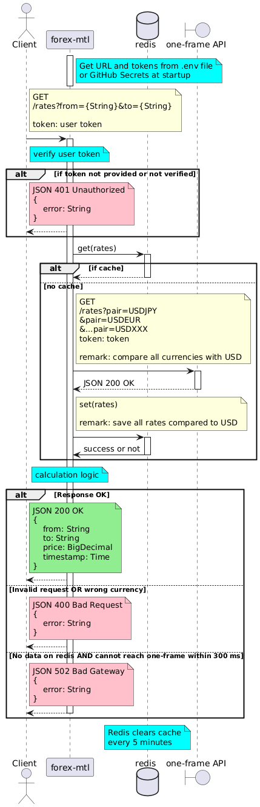

# Paidy Take-Home Coding Exercises (Forex)

## 💱 Exchange Rate API

### `GET /rates`

Fetches the latest exchange rate between two currencies.

**Example Request:**
```bash
curl -H "token: your-auth-token" "http://localhost:8081/rates?from=JPY&to=USD"
```
Remark: `your-auth-token` can be set in the configuration file `.env`

**Example Successful Response (200 OK):**
```json
{
  "from": "EUR",
  "to": "THB",
  "price": 39.5721,
  "timestamp": "2025-10-18T14:22:15Z"
}
```

**Example Error Response (400 Bad Request):**
```json
{
  "error": "Invalid request. Please provide both currencies in scope."
}
```

### Setup

1. Start One-Frame API
```bash
docker run -p 8080:8080 paidyinc/one-frame
```
2. Start Redis
```bash
docker run -d --name redis-forex -p 6379:6379 redis:7-alpine
```
3. Navigate to the forex-mtl folder
```bash
cd forex-mtl
```
4. Configure environment variables
- Copy the template `.env.example` to `.env`
```bash
cp .env.example .env
```
- Fill in the actual values in `.env`
```
ONEFRAME_TOKEN=your-oneframe-token
ONEFRAME_URL=http://localhost:8080/rates
REDIS_URL=redis://localhost:6379
AUTH_TOKEN=your-auth-token
```
5. Start Forex Application
```bash
sbt run
```

## Functional Requirements (Assumptions Included)
> The service returns an exchange rate when provided with 2 supported currencies
1. Users can **call the endpoint `/rates`** with `from` and `to` to receive an exchange rate.
2. Users receive a **rounded** exchange rate with **4 decimal digits if the rate is greater than or equal to 0.1000** or **4 significant digits if the rate is less than 0.1000**.
3. Users receive an exchange rate only for currencies in scope (see **Appendix** for Currencies in Scope).
4. All exchange rates are equally available to users; **no currency pair has higher priority or peak usage.**
> The rate should not be older than 5 minutes.
5. The rate should **not be older than 5 minutes**.
> The service should support at least 10,000 successful requests per day **with 1 API token**.

6. The service **verifies the user token** and returns a successful response only for requests with a verified token.
7. The service returns the error message and HTTP status code for the corresponding error cases (see **Appendix** for Error Responses).

## Non-functional Requirements (Assumptions Included)
1. Users can receive a response in real time with **latency less than 500 ms** when testing locally. We assume that all users are in Japan.
> The service should support **at least 10,000 successful requests per day** with 1 API token.
2. The service supports **at least 10,000 successful requests per day**.
3. The service can call **One-Frame API only 1000 times** per day. There is no limitation on the request length or response size of the One-Frame API.
4. The service has **unit tests** for successful cases (for an exchange rate greater than and less than 0.1) and error cases.
5. The service should be able to handle **a maximum of 3 requests concurrently** (under 6 QPS).

## Sequence Diagram



## Implementation Details
1. Forex-mtl fetches URLs, configurations, user token, and One-Frame token from .env at startup.
2. When receiving a request, forex-mtl verifies the user token. Forex-mtl returns `401 Unauthorized error` if the token is not verified or does not exist.
3. Forex-mtl verifies the request. The `from` and `to` parameters must be present, and both currencies should be in scope. If not, it returns `400 Bad Request`.
4. Forex-mtl implements caching with Redis, refreshing every 300 seconds.
5. When there is no cache in Redis:  
    * Forex-mtl calls the One-Frame API with 165 pairs to get all currencies against USD.
    * If forex-mtl cannot call the One-Frame API within 300 ms, it returns `503 Service Unavailable`.
    * Then, forex-mtl sets the cache in Redis with the key `rates` and the value for the response.
    * Concurrent updates for Redis are acceptable, and only the last update is saved ("last write wins").
    * Remark: Estimated response size ≈ 23 KB.
6. When there is a cache in Redis:
    * Forex-mtl gets all currency rates against USD from Redis.
7. Forex-mtl calculates exchange rates.  
For example, `USD to JPY = R1`, `USD to EUR = R2`, it calculates using the following formula:
    ```math
    \text{JPY} → \text{EUR}=\frac{R2}{R1}​
    ```
    * If the value is greater than or equal to 0.1000, round the value to 4 decimal digits.
    * If the value is less than 0.1000, round the value to 4 significant digits.
8. Forex-mtl returns an exchange rate to user with a timestamp.

---

## Appendix
### Currencies in Scope*
AED, AFN, ALL, AMD, ANG, AOA, ARS, AUD, AWG, AZN, BAM, BBD, BDT, BGN, BHD, BIF, BMD, BND, BOB, BRL, BSD, BTN, BWP, BYN, BZD, CAD, CDF, CHF, CLP, CNY, COP, CRC, CUC, CUP, CVE, CZK, DJF, DKK, DOP, DZD, EGP, ERN, ETB, EUR, FJD, FKP, GBP, GEL, GGP, GHS, GIP, GMD, GNF, GTQ, GYD, HKD, HNL, HRK, HTG, HUF, IDR, ILS, IMP, INR, IQD, IRR, ISK, JEP, JMD, JOD, JPY, KES, KGS, KHR, KMF, KPW, KRW, KWD, KYD, KZT, LAK, LBP, LKR, LRD, LSL, LYD, MAD, MDL, MGA, MKD, MMK, MNT, MOP, MRU, MUR, MVR, MWK, MXN, MYR, MZN, NAD, NGN, NIO, NOK, NPR, NZD, OMR, PAB, PEN, PGK, PHP, PKR, PLN, PYG, QAR, RON, RSD, RUB, RWF, SAR, SBD, SCR, SDG, SEK, SGD, SHP, SLL, SOS, SPL, SRD, STN, SVC, SYP, SZL, THB, TJS, TMT, TND, TOP, TRY, TTD, TVD, TWD, TZS, UAH, UGX, USD, UYU, UZS, VEF, VND, VUV, WST, XAF, XCD, XDR, XOF, XPF, YER, ZAR, ZMW, ZWD

*Same as One-Frame API.

### Error Responses
| Error case | HTTP status code | Message |
|---|---|---|
| Token not provided or token verification failed | 401 Unauthorized | Token verification failed. Please provide the correct token. |
| Invalid request, insufficient parameters, or currency out of scope | 400 Bad Request | Invalid request. Please provide both currencies in scope. |
| Unable to connect to the One-Frame Service when there is no saved data | 503 Service Unavailable | Unable to reach external rate service. Please try again later. |
| Other unexpected errors while processing requests | 500 Internal Server Error | Internal error. Please contact the developer. |

### Manual Test

Manual test has been performed. Please refer to [manual-test.md](manual-test.md).

### QPS calculation
#### Maximum times of cache clearing per day (every 5 minutes)
```math
\frac{\text{seconds in one day}}{\text{seconds to clear cache}} = \frac{86400\ \text{seconds}}{300\ \text{seconds per time}} = 288\ \text{times}
```
Redis clears cache every 5 minutes. There are maximum 288 times for the service to call One-Frame API, if Redis is not down.
#### Maximum concurrency to call Once Frame API 

```math
\frac{\text{One Frame API limit}}{\text{Times to call API}} = \frac{1000\ \text{requests}}{288\ \text{times}} ≈  3\ \text{requests per time}
```

Service can receive **maximum 3 requests concurrently**
#### Maximum QPS

```math
\text{QPS} = \frac{\text{Concurrency}}{\text{Latency}} = \frac{3}{0.5\ \text{second}} = 6
```

Service can receive **maximum 6 QPS**
If actual latency is lower than 500 ms, **QPS will proportionally increase.**
