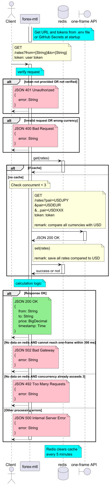

# Paidy Take-Home Coding Exercises (Forex)

## Functional Requirements (Assumptions Included)
> The service returns an exchange rate when provided with 2 supported currencies
1. Users can **call the endpoint `/rates`** with `from` and `to` to receive an exchange rate.
2. Users receive a **rounded** exchange rate with **4 decimal digits if the rate is more than or equal to 0.1000** or **4 significant digits if the rate is less than 0.1000**.
3. Users receive an exchange rate only for currencies in scope (See **Appendix** for Currencies in Scope).
> The rate should not be older than 5 minutes.
4. The rate should **not be older than 5 minutes**.
> The service should support at least 10,000 successful requests per day **with 1 API token**.

5. The service **verifies the user token** and gives a successful response only to requests with a verified token.
6. The service returns the error message and HTTP status code for the corresponding error cases (See **Appendix** for Error Responses).

## Non-functional Requirements (Assumptions Included)
1. Users can receive a response in real time with **latency less than 500 ms** when testing locally.
> The service should support **at least 10,000 successful requests per day** with 1 API token.
2. The service supports **at least 10,000 successful requests per day**.
3. The service has a **local cache/database to save currency values**, so it does not call the One-Frame API for every request it receives (Can call One-Frame API only 1000 times per day).
4. The service has **unit tests** for successful cases (for an exchange rate greater than and less than 0.1) and error cases.
5. The service provides **OpenAPI documentation** on the endpoint `/docs`.
6. The service must **store user tokens and the One-Frame API token only in secure storage** with encryption in production.
7. The service should be able to handle maximum 2 requests concurrently.

## Sequence Diagram

## Appendix
### Currencies in Scope*
AED, AFN, ALL, AMD, ANG, AOA, ARS, AUD, AWG, AZN, BAM, BBD, BDT, BGN, BHD, BIF, BMD, BND, BOB, BRL, BSD, BTN, BWP, BYN, BZD, CAD, CDF, CHF, CLP, CNY, COP, CRC, CUC, CUP, CVE, CZK, DJF, DKK, DOP, DZD, EGP, ERN, ETB, EUR, FJD, FKP, GBP, GEL, GGP, GHS, GIP, GMD, GNF, GTQ, GYD, HKD, HNL, HRK, HTG, HUF, IDR, ILS, IMP, INR, IQD, IRR, ISK, JEP, JMD, JOD, JPY, KES, KGS, KHR, KMF, KPW, KRW, KWD, KYD, KZT, LAK, LBP, LKR, LRD, LSL, LYD, MAD, MDL, MGA, MKD, MMK, MNT, MOP, MRU, MUR, MVR, MWK, MXN, MYR, MZN, NAD, NGN, NIO, NOK, NPR, NZD, OMR, PAB, PEN, PGK, PHP, PKR, PLN, PYG, QAR, RON, RSD, RUB, RWF, SAR, SBD, SCR, SDG, SEK, SGD, SHP, SLL, SOS, SPL, SRD, STN, SVC, SYP, SZL, THB, TJS, TMT, TND, TOP, TRY, TTD, TVD, TWD, TZS, UAH, UGX, USD, UYU, UZS, VEF, VND, VUV, WST, XAF, XCD, XDR, XOF, XPF, YER, ZAR, ZMW, ZWD

*Same as One-Frame API.

### Error Responses
| Error case | HTTP status code | Message |
|---|---|---|
| Token not provided, token verification failed | 401 Unauthorized | Token verification failed. Please provide the correct token. |
| Invalid request, insufficient parameters, currency out of scope | 400 Bad Request | Invalid request. 
| Unable to connect to the One-Frame Service when there is no saved data | 503 Service Unavailable | Unable to reach external rate service. Please try again later. |
| Other unexpected errors while processing requests | 500 Internal Server Error | Internal error. Please contact the developer. |