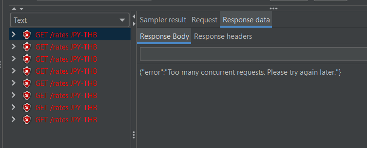
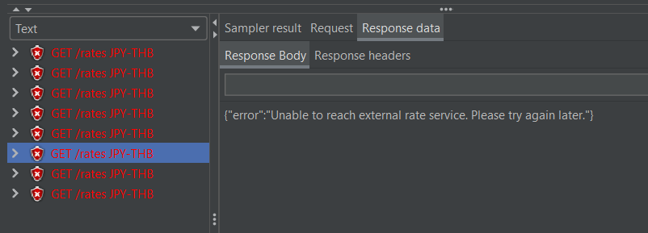
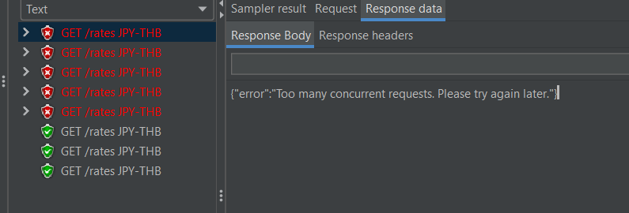
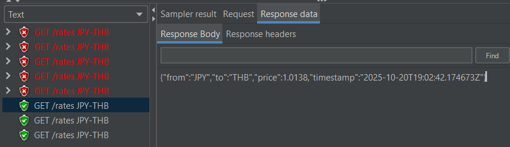

# Performance Test Plan

## Test Objective
- Validate that the Forex API system behaves correctly:
  1. Returns data successfully immediately after startup.
  2. Correctly calls One-Frame API and stores the result in Redis on cache miss.
  3. Ensures concurrency limit of 3 for cache-miss requests.

## Test Scenario
| Scenario | Redis Cache State | Expected Behavior |
|------|-----------------|-----------------|
| Startup | Empty | Forex returns data via One-Frame API and stores in Redis or 429 Error for requests that exceed concurrency | 
| Cache hits | Populated | Forex returns data from the cache without calling One-Frame API | 
| Cache miss (After 5 minutes) | Empty | Forex returns data via One-Frame API and stores in Redis or 429 Error for requests that exceed concurrency |
| Cache miss (After 5 minutes) and no connection to One-Frame API | Empty | Forex returns 503 Service Unavailable or 429 Error for requests that exceed concurrency |
| Reconnect to One-Frame API after cache miss and no connection | Empty | Forex returns data via One-Frame API and stores in Redis or 429 Error for requests that exceed concurrency |

## Result
1. Test at startup with 8 concurrency:
    - 3 successful requests with 3 calls to One-Frame API (Confirmed by One-Frame API logs)
    - 5 429 Too Many Requests errors
    
    
   
    - The 3 successful requests got all 3 different values
    
    
    
    
    
    
    
3. Test hitting cache with 8 concurrency:
    - 8 successful requests with the same value as the last successful request from 1. without calling One-Frame API (Confirmed by One-Frame API logs)
    
    
    
4. Test missing cache with 8 concurrency:
    - 8 successful requests with 2 calls to One-Frame API (Confirmed by One-Frame API logs)
    
    
    
    - 1st request got value 1.0083 (aligned with One-Frame API 1st request)
    
    
   
    - 2nd–8th requests got value 1.0138 (aligned with One-Frame API 2nd request)
    
    

5. Test missing cache and no connection to One-Frame API with 8 concurrency:
    - 8 errors requests (3 503 Service Unavailable errors and 5 429 Too Many Requests errors)

    

    

6. Test after reconnecting to One-Frame API with 8 concurrency:
    - 3 successful requests with 3 calls to One-Frame API (Confirmed by One-Frame API logs)

    

    - 5 429 Too Many Requests errors (Same as 1.)
    
    

    

## Discussion
Only at startup did the One-Frame API get called a maximum of three times. It can be assumed that the One-Frame API might be slow during startup, so the request triggered up to three calls with all three returning different values.

After the cache was stored, subsequent calls returned data directly from the cache, confirming the "Last Write Wins" behavior.

After the cache was cleared in 5 minutes, the request called the One-Frame API twice, showing different values. This indicates that Forex provides updated rates within 5 minutes. It can also be assumed that the One-Frame API becomes quicker after startup and can respond fast enough for the cache to be stored promptly, avoiding the maximum concurrency limit of three.

Then, when simulating a situation where the One-Frame API was down, the rate limit worked correctly to limit further requests. After reconnecting to the One-Frame API, it reproduced the rate behavior seen during startup.

## Conclusion
This test proved the caching logic "Last Write Wins," ensuring that the rate is not older than 5 minutes and One-Frame API is not called with more than 3 concurrent requests.

## Notes
- Use `token.csv` to edit the auth token to call the Forex API.
