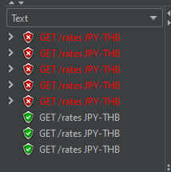
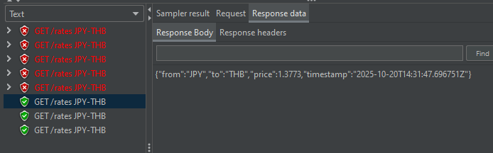
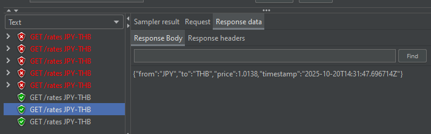
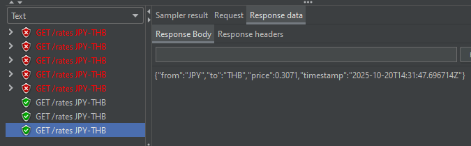
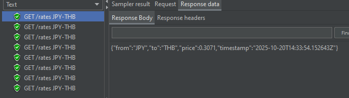
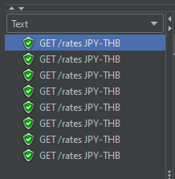
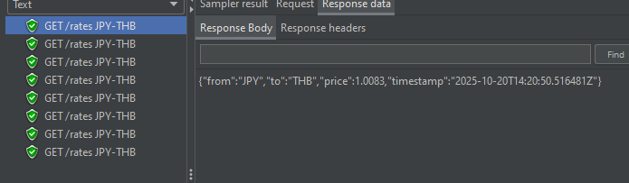
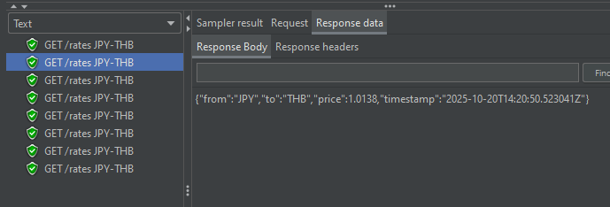

# Performance Test Plan

## Test Objective
- Validate that the Forex API system behaves correctly:
  1. Returns data successfully immediately after startup.
  2. Correctly calls One-Frame API and stores the result in Redis on cache miss.
  3. Ensures concurrency limit of 3 for cache-miss requests.

## Test Scenario
| Scenario | Redis Cache State | Expected Behavior |
|------|-----------------|-----------------|
| Startup | Empty | Forex returns data via One-Frame API and stores in Redis or 429 Error for requests that exceed concurrency | 
| Cache hits | Populated | Forex returns data from the cache without calling One-Frame API | 
| Cache Miss (After 5 minutes) | Empty | Forex returns data via One-Frame API and stores in Redis or 429 Error for requests that exceed concurrency |

## Result
1. Test at startup with 8 concurrency:
    - 3 successful requests with 3 calls to One-Frame API (Confirmed by One-Frame API logs)
    - 5 429 Too Many Requests Errors
    
    - The 3 successful requests got all 3 different values
    
    
    
2. Test hitting cache with 8 concurrency:
    - 8 successful requests with the same value as the last successful request from 1. without calling One-Frame API (Confirmed by One-Frame API logs)
    
3. Test missing cache with 8 concurrency:
    - 8 successful requests with 2 calls to One-Frame API (Confirmed by One-Frame API logs)
    
    - 1st request got value 1.0083 (aligned with One-Frame API 1st request)
    
    - 2nd–8th requests got value 1.0138 (aligned with One-Frame API 2nd request)
    

## Discussion
Only at startup did One-Frame API get called a maximum of three times. It can be assumed that One-Frame API might be slow at startup, so the request called One-Frame API a maximum of 3 times with all three different values.

After the cache was stored, the following calls returned data directly from the cache, confirming "Last Write Wins".

After the cache was cleared in 5 minutes, the request called One-Frame API twice, showing different values. This means that Forex provides rates no later than 5 minutes. It can be assumed that One-Frame API gets quicker after startup and can respond fast enough so that the cache is stored quickly, avoiding the maximum 3 concurrency limit.

## Conclusion
This test proved the caching logic "Last Write Wins," ensuring that the rate is not older than 5 minutes and One-Frame API is not called with more than 3 concurrent requests.

## Notes
- Use `token.csv` to edit the auth token to call the Forex API.
