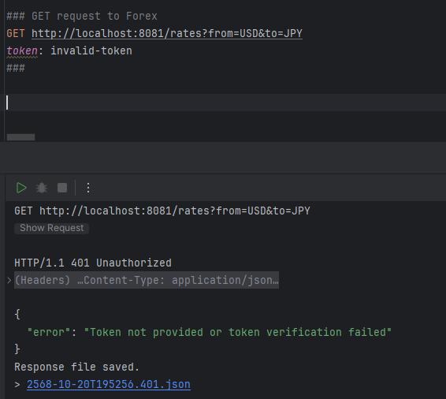
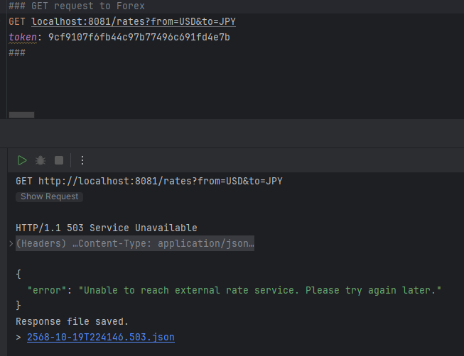

# Forex API Manual Test Cases

---

## Test Case 1: Happy Case (USD/JPY)

**Purpose:** Verify that the API returns the correct rate for USD→JPY.
**Endpoint:** GET `/rates`
**Headers:** `token: 9cf9107f6fb44c97b77496c691fd4e7b`
**Query Parameters:** `from=USD`, `to=JPY`

**Request Example:**

```http
GET http://localhost:8081/rates?from=USD&to=JPY
token: 9cf9107f6fb44c97b77496c691fd4e7b
```

**Expected Response:**

```json
{
  "from": "USD",
  "to": "JPY",
  "rate": any rate,
  "timestamp": any timestamp
}
```

**Actual Response / Proof:**


---

## Test Case 2: Happy Case (EUR/JPY)

**Purpose:** Verify that the API returns the correct rate for EUR→JPY.
**Endpoint:** GET `/rates`
**Headers:** `token: 9cf9107f6fb44c97b77496c691fd4e7b`
**Query Parameters:** `from=EUR`, `to=JPY`

**Request Example:**

```http
GET http://localhost:8081/rates?from=EUR&to=JPY
token: 9cf9107f6fb44c97b77496c691fd4e7b
```

**Expected Response:**

```json
{
  "from": "EUR",
  "to": "JPY",
  "rate": any rate,
  "timestamp": any timestamp
}
```

**Actual Response / Proof:**


---

## Test Case 3: Invalid Token

**Purpose:** Ensure unauthorized access is blocked.
**Endpoint:** GET `/rates`
**Headers:** `token: invalid-token`
**Query Parameters:** `from=USD`, `to=JPY`

**Request Example:**

```http
GET http://localhost:8081/rates?from=USD&to=JPY
token: invalid-token
```

**Expected Response:**

```json
{
  "error": "Token not provided or token verification failed"
}
```

**Actual Response / Proof:**


---

## Test Case 4: Missing Query Parameter

**Purpose:** Validate request parameter checking.
**Endpoint:** GET `/rates`
**Headers:** `token: 9cf9107f6fb44c97b77496c691fd4e7b`
**Query Parameters:** `from=USD` (missing `to`)

**Request Example:**

```http
GET http://localhost:8081/rates?from=USD
token: 9cf9107f6fb44c97b77496c691fd4e7b
```

**Expected Response:**

```json
{
  "error": "Invalid request. Please provide both currencies in scope."
}
```

**Actual Response / Proof:**


---

## Test Case 5: Currency Not in Scope

**Purpose:** Ensure API validates unsupported currencies.
**Endpoint:** GET `/rates`
**Headers:** `token: 9cf9107f6fb44c97b77496c691fd4e7b`
**Query Parameters:** `from=ABC`, `to=USD`

**Request Example:**

```http
GET http://localhost:8081/rates?from=ABC&to=USD
token: 9cf9107f6fb44c97b77496c691fd4e7b
```

**Expected Response:**

```json
{
  "error": "Invalid request. Please provide both currencies in scope."
}
```

**Actual Response / Proof:**


---

## Test Case 6: Cache misses and API is Down

**Purpose:** Verify handling when external rate service is unreachable.
**Endpoint:** GET `/rates`
**Headers:** `token: 9cf9107f6fb44c97b77496c691fd4e7b`
**Query Parameters:** `from=USD`, `to=JPY`

**Request Example:**

```http
GET http://localhost:8081/rates?from=USD&to=JPY
token: 9cf9107f6fb44c97b77496c691fd4e7b
```

**Expected Response:**

```json
{
  "error": "Unable to reach external rate service. Please try again later."
}
```

**Actual Response / Proof:**

---